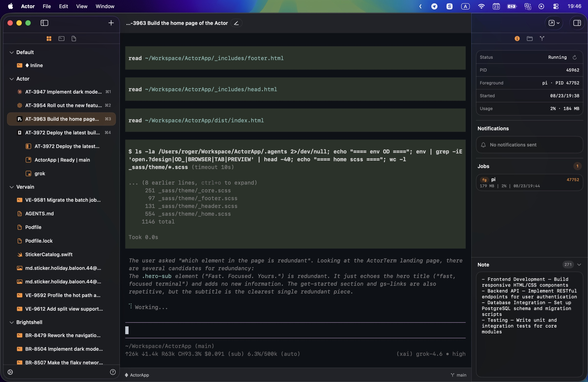

  

<h1 align="center">Actor</h1>

  A terminal workspace for macOS. 
  Ghostty-powered, with a hierarchical sidebar. Native, lightweight, no setup.

  
  &nbsp;
  

  macOS 15+ · signed &amp; notarized · free

  

  <a href="https://stillmake.com/actor">stillmake.com/actor</a>
  ·
  <a href="https://stillmake.com/actor/releases/">release notes</a>
  ·
  <a href="https://github.com/Stillmake/ActorApp/releases">GitHub Releases</a>

